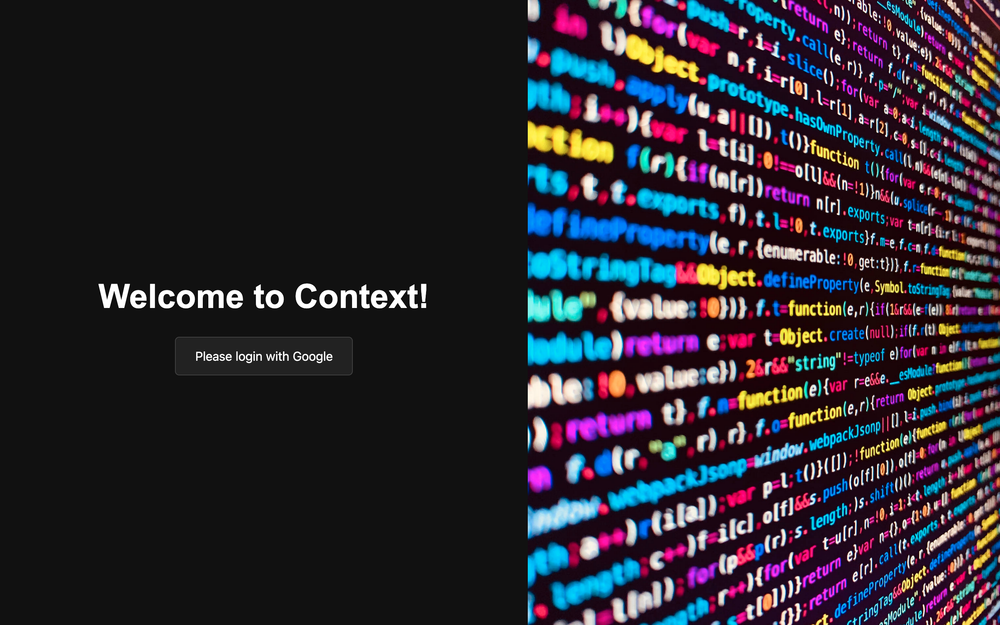
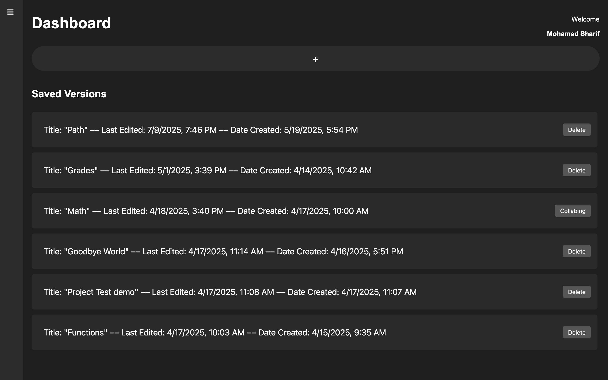
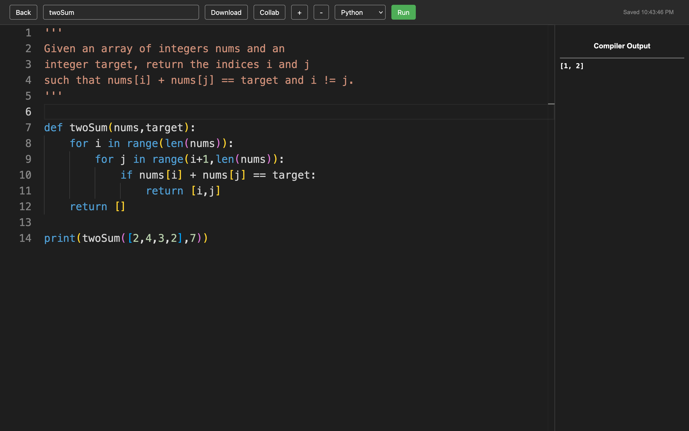

# Context

Context is a real-time collaborative online code editor that allows users to write, execute, and collaborate on code inside a browser. It provides a VS Code-grade Monaco editing environment paired with cloud auto-save, remote multi-language compilation, and granular document sharing.

## Features

- **Monaco Code Editor**: Full-featured VS Code editing experience with syntax highlighting, line numbers, and multi-cursor support.
- **Remote Code Execution**: Compiles and runs Python and C code remotely via Judge0 API integration with live output streaming.
- **Throttled Cloud Auto-Save**: Real-time document persistence to Firestore every 2 seconds with visual sync indicators.
- **Document Management**: Create, view, rename, and manage multiple isolated code documents from a centralized dashboard.
- **Role-Based Collaboration**: Share documents with team members via email invites with view/edit permission controls.
- **Authentication**: Secure Google OAuth authentication managed through Firebase Auth.

## Architecture

### Engineering Highlights

- **Throttled Persistence**: Employs a custom `useAutoSave` hook that throttles document writes to Firestore at 2-second intervals, minimizing database write operations while guaranteeing low latency feedback for the user.
- **Indexed Real-Time Queries**: Leverages Firestore indexed `where()` clauses and snapshot listeners to stream updates only for documents the authenticated user owns or collaborates on.
- **Role-Based Security Model**: Enforces document ownership and collaborator permissions across both client-side route guards and server-side Firestore security rules.
- **Route-Based Code Splitting**: Utilizes dynamic React imports and lazy loading for heavy modules (like the Monaco Editor bundle), cutting initial page payload by ~70%.

### Project Structure

```text
context-editor/
├── public/                     # Static assets and index HTML
├── src/
│   ├── components/             # Reusable UI components
│   │   ├── ErrorBoundary.js    # Application crash protection
│   │   └── LoadingSpinner.js   # Async state indicators
│   ├── hooks/                  # Custom business logic and state hooks
│   │   ├── useAuth.js          # Authentication state management
│   │   ├── useAutoSave.js      # Throttled auto-save logic
│   │   ├── useDocument.js      # Single-document real-time Firestore sync
│   │   └── useDocuments.js     # User document collection queries
│   ├── services/               # Data access and API integration layer
│   │   ├── authService.js      # Firebase Auth methods
│   │   ├── codeExecutionService.js # Judge0 execution API client
│   │   └── documentService.js  # Firestore CRUD operations & security rules
│   ├── utils/                  # Utility helpers, constants, and logging
│   ├── App.js                  # Route configuration and core layout
│   ├── DocsDashboard.js        # Main document dashboard
│   ├── LoginPage.js            # OAuth authentication landing view
│   ├── CollabModal.js          # Share and collaborator invite modal
│   └── firebaseConfig.js       # Firebase client SDK initialization
├── package.json                # Project dependencies and scripts
└── .env                        # Environment configuration
```

## Tech Stack

- **Frontend**: React 19, Monaco Editor (`@monaco-editor/react`), React Router DOM, React Hot Toast
- **Backend & Database**: Firebase Authentication (Google OAuth), Cloud Firestore
- **Code Execution**: Judge0 API via RapidAPI
- **Communications**: EmailJS (collaboration invite notifications)

## Usage & Workflows

1. **Authentication**: Sign in with a Google account to establish workspace identity.
2. **Document Creation**: Initialize a new document from the dashboard and select the target programming language (Python or C).
3. **Editing & Auto-Save**: Code in the Monaco editor; edits are automatically throttled and persisted to Cloud Firestore.
4. **Code Execution**: Click **Run** to submit the code buffer to Judge0 and view stdout/stderr output in the integrated console.
5. **Collaboration**: Click **Collab** to invite contributors by email and assign access permissions.
6. **Export**: Export code files locally as standalone source files.

## Limitations & Trade-offs

- **Concurrency Model**: Uses a last-write-wins approach without operational transformation (OT) or CRDT-based character merging.
- **Language Support**: Currently configured for Python and C execution pipelines; additional languages require Judge0 runtime profile mappings.
- **Collaboration Accounts**: Email invites require recipients to sign in with an active Google account to resolve permissions.

## User Interface

**Login Page:** Simple and secure Google authentication to access your workspace.



**Dashboard:** Manage your saved code documents, create new ones, or delete old ones.



**Editor:** A full-featured Monaco editor with syntax highlighting, live execution, and collaboration tools.



## Getting Started

### Prerequisites

- [Node.js](https://nodejs.org/) (v18.x or higher)
- npm (bundled with Node.js)

```bash
node -v
npm -v
```

### Installation

1. Clone the repository:

```bash
git clone https://github.com/4Sharif/Context.git
cd Context/context-editor
```

2. Install dependencies:

```bash
npm install
```

3. Configure environment variables in `.env`:

```env
REACT_APP_FIREBASE_API_KEY=your_api_key
REACT_APP_FIREBASE_AUTH_DOMAIN=your_project.firebaseapp.com
REACT_APP_FIREBASE_PROJECT_ID=your_project_id
REACT_APP_FIREBASE_STORAGE_BUCKET=your_project.appspot.com
REACT_APP_FIREBASE_MESSAGING_SENDER_ID=your_sender_id
REACT_APP_FIREBASE_APP_ID=your_app_id
REACT_APP_RAPIDAPI_KEY=your_judge0_rapidapi_key
REACT_APP_EMAILJS_SERVICE_ID=your_emailjs_service_id
REACT_APP_EMAILJS_TEMPLATE_ID=your_emailjs_template_id
REACT_APP_EMAILJS_PUBLIC_KEY=your_emailjs_public_key
```

4. Deploy Firestore security rules:
   - Copy the security rule block documented in `src/services/documentService.js`.
   - Publish the rules in the Firebase Console under **Firestore Database → Rules**.

### Running

Start the local development server:

```bash
npm start
```

Open [http://localhost:3000](http://localhost:3000) in your browser.